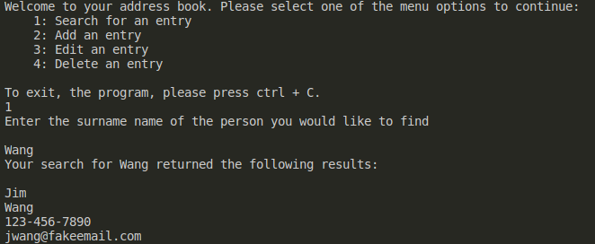
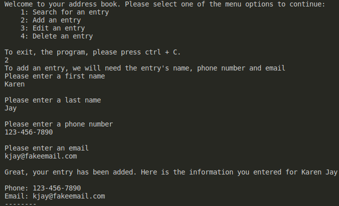
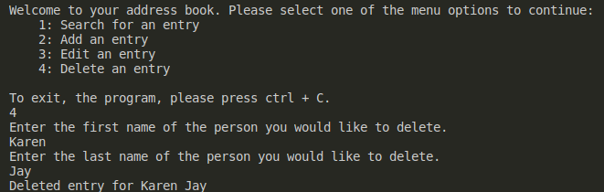
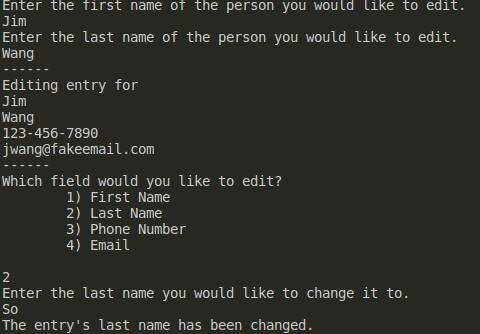

# shell-scripting-practice
The examples folder contains scripts I copied and ran for personal learning.

The address book folder contains a project I did to practice these concepts. 

# Address Book Project

The address book is basically a program for searching, adding, deleting, and editing contacts in the address book. Entries are stored in the entries subfolder which are then accessed through the program.

## Search

Given a surname, lists all records with that surname.

## Add

Adds an entry to the address book. You need to provide a first name, a last name, a phone number, and an email.

## Delete

Deletes an entry from the address book. You need to provide a first name and a last name.  

## Edit

Edits a field of an entry. You need to first provide the first and last name of the entry you want to edit and then specify which field you would like to change. You then provide the new information. 

